# отчет по лабораторной

## делали: пархоменко, губенко, чуйко

установка wireguard
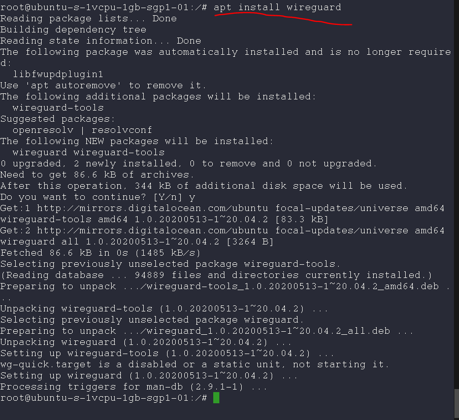

перенаправление трафика
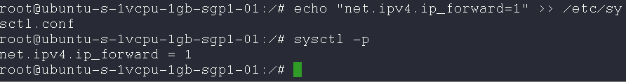

создание ключей
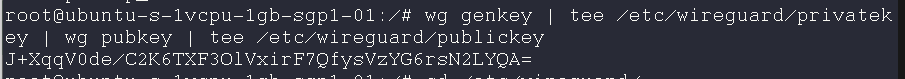

создание конфига впн сервера
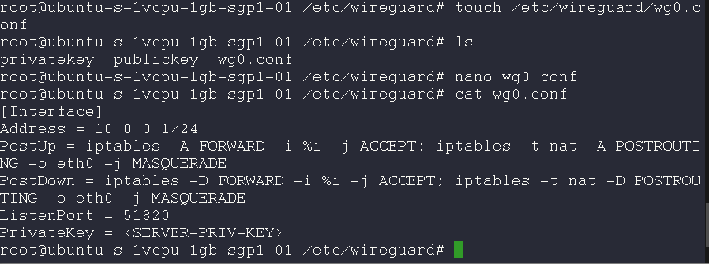
проверили, что все работает и создали ключи юзера
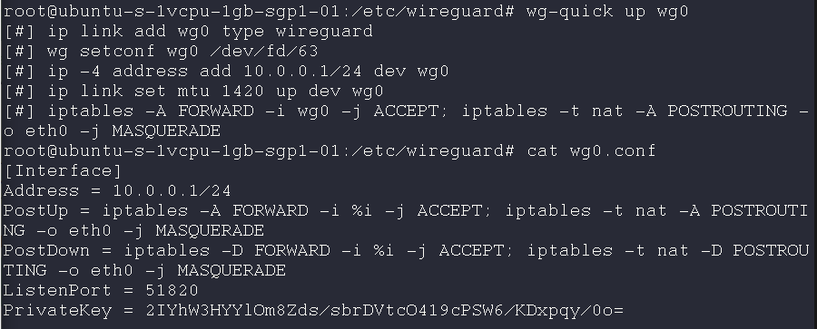
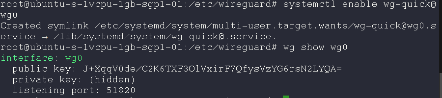
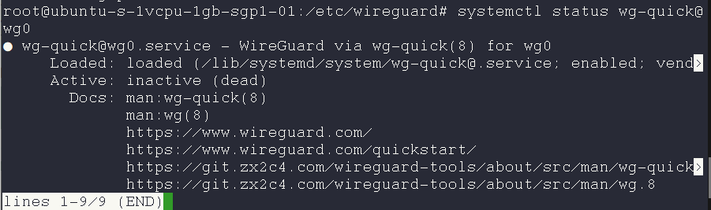
добавили юзера 
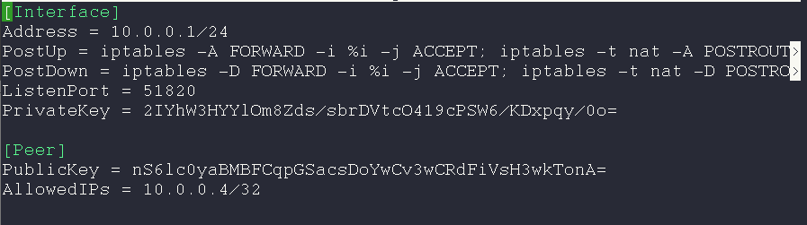
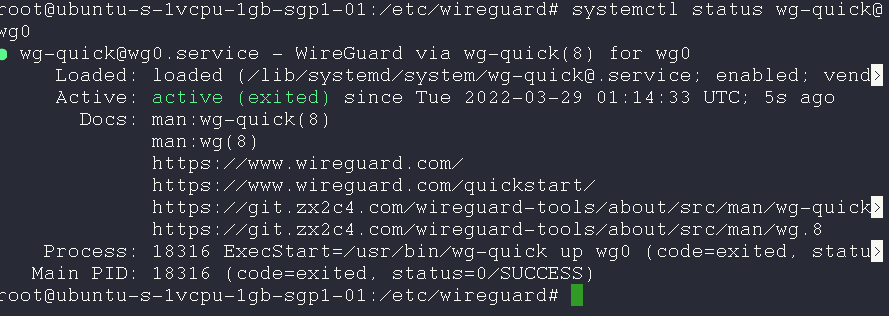
Захват трафика, для конфига q.conf в репозитории с отчетом лежит конфиг 
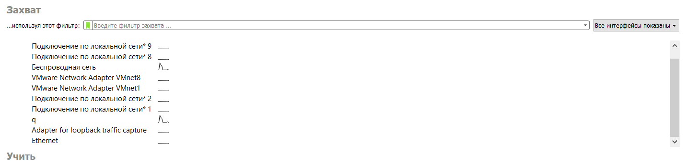
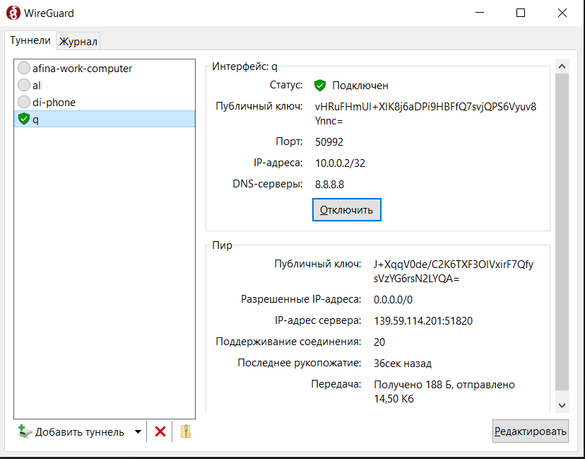
